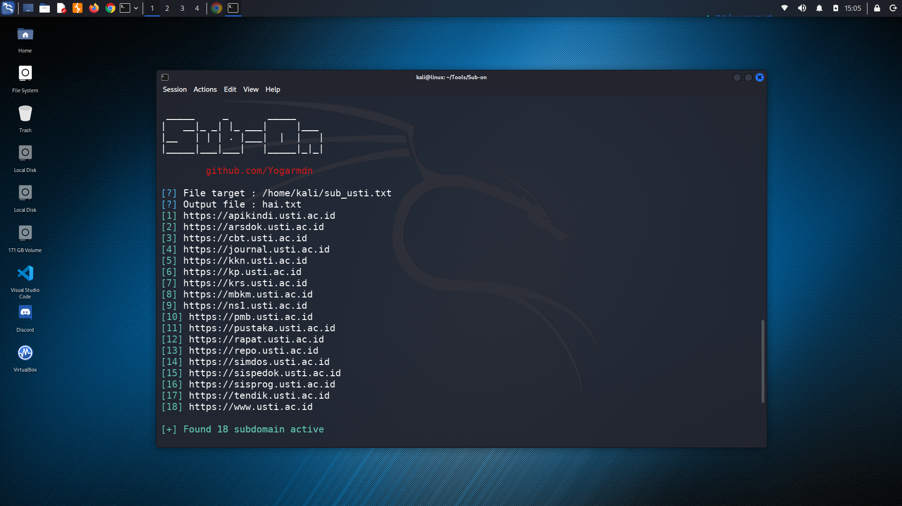

# Sub-on
This tool is a tool that utilizes the httpx tool with the subprocess module.

## How to use Tools
```
git clone https://github.com/YogaRmdn/Sub-on
cd Sub-on
pip install -r requerements.txt
python subon.py
```

## Screenshot

